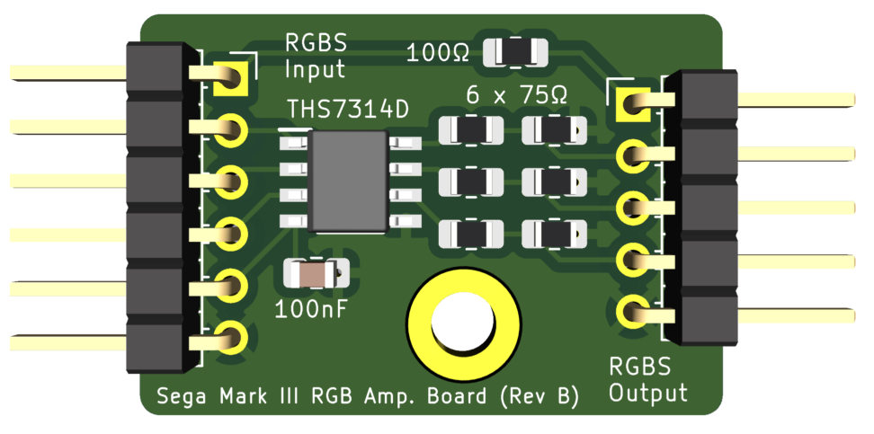

# Sega Mark III RGB Amplifier
Internal amplifier board for the Sega Mark III RGB output. 

The RGB output is apparently a bit dim so one solution is to use a THS7314D (or similar) video amplifier to boost the output level.  This part is surface mount so I've designed the whole board to be surface mount. 

Based on design & ideas by [にがMSX](http://niga2.sytes.net/msx/mk3.html) 

This implementation not yet tested (as of 9-Sept-2023).  Will update once test boards have been fabricated & tested. 

Design uses: 
- 6 x 75Ω (0805) resistors
- 1 x 100Ω (0805) resistor
- 1 x 100nF (0805) capacitor
- 1 x THS7314D video amplifier (6dB gain)
- 6-pin header for RGBS+power input
- 5-pin header for RGBS+ground output

## Status
22-Nov-2025: completely re-designed the PCB
