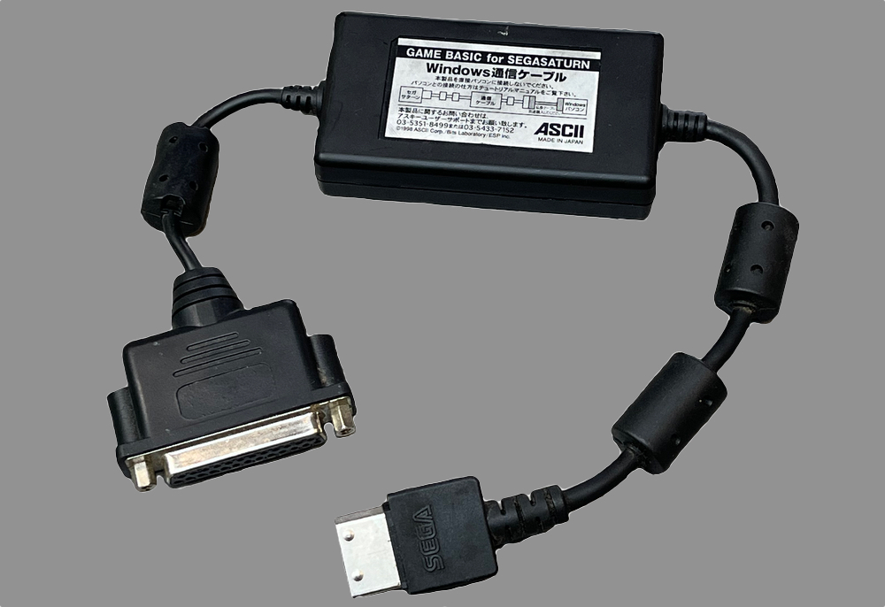
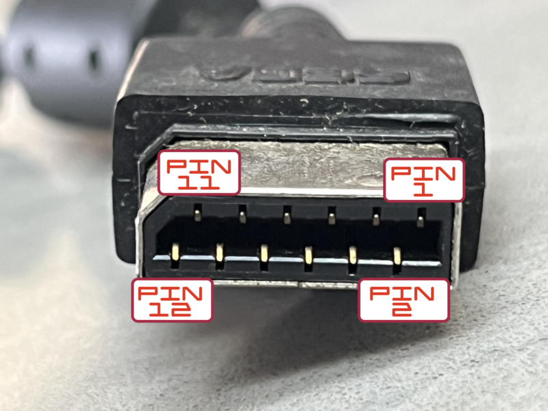

# Windows Communication Cable
# Windows通信ケーブル
This cable comes bundled with GAME BASIC for SEGA SATURN.<br>
The cable plugs into the Saturn's Communications port at one end and into a Window computer's RS232 serial port on the other end.<br>
It uses an [NEC D4711B](Documentation/NEC_UPD4711BGS_Datasheet.pdf) RS-232 line driver/receiver to handle the communications between the Saturn and the Windows machine.<br>



## Windows RS232
On the Windows side it uses two wires plus shield:<br>
- red (アカ) wire connected to pin 2 (RS232 Transmit)
- white (シロ) wire connected to pin 3 (RS232 Receive)
- shield (シールド) wire connected to pin 7 (RS232 signal ground) plus shield

The DE9 cable equivalents would be:<br>
- red (アカ) wire connected to pin 3 (RS232 Transmit)
- white (シロ) wire connected to pin 2 (RS232 Receive)
- shield (シールド) wire connected to pin 5 (RS232 signal ground) plus shield

## Sega Saturn Communication Port (looking at cable)
I don't know if this is the "official" pinout, but I read that the angled corner is supposed to indicate pin 11/12 and odd-on-top, even-on-bottom.  So this is what I've used.<br>
```
   11          1
 _________________
/  | | | | | | | |
|_|_|_|_|_|_|_|__|
 12           2
```
On the Saturn side it uses three wires plus shield:<br>
- red (アカ) to pin 2
- white (シロ) to pin 5
- black (クロ) to pin 6
- shield (シールド) to pins 8 & 12 (plus outside shield)



## Warning
The cable includes a warning:<br>
> 本製品を直接パソコンに接続しないでください。<br>
> パソコンとの接続の仕方はチュートリアルマニュアルをご覧下さい。<br>

This translates as:<br>
> Do not connect this product directly to a computer.
> Please see the tutorial manual for how to connect to a computer.

However the [manual](Documentation/Cable_Instructions_3_ENG.jpg) just details that an RS232 straight-through/modem cable should be used. My guess is that the cable is too short to properly connect the Saturn to your computer, so an extension cable should be used.<br>

The relevant three pages can be found in the [Documentation](Documentation) folder - both in original Japanese and Google-translated English.
